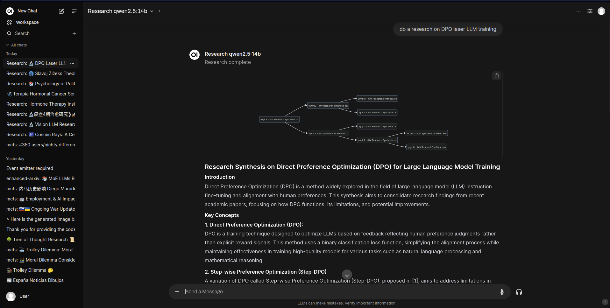

# Open WebUI Tools Collection

[](https://github.com/open-webui/open-webui)
[](https://opensource.org/licenses/MIT)
[](https://www.python.org/)
[](CONTRIBUTING.md)

> **🚀 A modular collection of tools, function pipes, and filters to supercharge your Open WebUI experience.**

Transform your Open WebUI instance into a powerful AI workstation with this comprehensive toolkit. From academic research and image generation to music creation and autonomous agents, this collection provides everything you need to extend your AI capabilities.

## ✨ What's Inside

This repository contains **16+ specialized tools and functions** designed to enhance your Open WebUI experience:

### 🛠️ **Tools**
- **arXiv Search** - Academic paper discovery (no API key required!)
- **Hugging Face Image Generator** - AI-powered image creation
- **ComfyUI ACE Step Audio** - Advanced music generation
- **Flux Kontext ComfyUI** - Professional image editing
  

### 🔄 **Function Pipes**
- **Planner Agent** - Autonomous task execution
- **arXiv Research MCTS** - Advanced research with Monte Carlo Tree Search
- **Multi Model Conversations** - Multi-agent discussions
- **Resume Analyzer** - Professional resume analysis
- **Mopidy Music Controller** - Music server management
- **Letta Agent** - Autonomous agent integration
- **MCP Pipe** - Model Context Protocol integration

### 🔧 **Filters**
- **Prompt Enhancer** - Automatic prompt improvement
- **Semantic Router** - Intelligent model selection
- **Full Document** - File processing capabilities
- **Clean Thinking Tags** - Conversation cleanup

## 🚀 Quick Start

### Option 1: Open WebUI Hub (Recommended)
1. Visit [https://openwebui.com/u/haervwe](https://openwebui.com/u/haervwe)
2. Browse the collection and click "Get" for desired tools
3. Follow the installation prompts in your Open WebUI instance

### Option 2: Manual Installation
1. Copy `.py` files from `tools/`, `functions/`, or `filters/` directories
2. Navigate to Open WebUI Workspace > Tools/Functions/Filters
3. Paste the code, provide a name and description, then save

## 🎯 Key Features

- **🔌 Plug-and-Play**: Most tools work out of the box with minimal configuration
- **🎨 Visual Integration**: Seamless integration with ComfyUI workflows
- **🤖 AI-Powered**: Advanced features like MCTS research and autonomous planning
- **📚 Academic Focus**: arXiv integration for research and academic work
- **🎵 Creative Tools**: Music generation and image editing capabilities
- **🔍 Smart Routing**: Intelligent model selection and conversation management
- **📄 Document Processing**: Full document analysis and resume processing
- **🌐 Web Integration**: Wikipedia search and web scraping capabilities

## 📋 Prerequisites

- **Open WebUI**: Version 0.6.0+ recommended
- **Python**: 3.8 or higher
- **Optional Dependencies**:
  - ComfyUI (for image/music generation tools)
  - Mopidy (for music controller)
  - Various API keys (Hugging Face, Tavily, etc.)

## 🔧 Configuration

Most tools are designed to work with minimal configuration. Key configuration areas:

- **API Keys**: Required for some tools (Hugging Face, Tavily, etc.)
- **ComfyUI Integration**: For image and music generation tools
- **Model Selection**: Choose appropriate models for your use case
- **Filter Setup**: Enable filters in your model configuration

---

## 📖 Detailed Documentation

### Table of Contents

1. [arXiv Search Tool](#arxiv-search-tool)
2. [Hugging Face Image Generator](#hugging-face-image-generator)
3. [ComfyUI ACE Step Audio Tool](#comfyui-ace-step-audio-tool)
4. [Flux Kontext ComfyUI Pipe](#flux-kontext-comfyui-pipe)
5. [Planner Agent](#planner-agent)
6. [arXiv Research MCTS Pipe](#arxiv-research-mcts-pipe)
7. [Multi Model Conversations Pipe](#multi-model-conversations-pipe)
8. [Resume Analyzer Pipe](#resume-analyzer-pipe)
9. [Mopidy Music Controller](#mopidy-music-controller)
10. [Letta Agent Pipe](#letta-agent-pipe)
11. [MCP Pipe](#mcp-pipe)
12. [Prompt Enhancer Filter](#prompt-enhancer-filter)
13. [Semantic Router Filter](#semantic-router-filter)
14. [Full Document Filter](#full-document-filter)
15. [Clean Thinking Tags Filter](#clean-thinking-tags-filter)
16. [Using the Provided ComfyUI Workflows](#using-the-provided-comfyui-workflows)
17. [Installation](#installation)
18. [Contributing](#contributing)
19. [License](#license)
20. [Credits](#credits)
21. [Support](#support)

---

## 🧪 Tools

### arXiv Search Tool

### Description
Search arXiv.org for relevant academic papers on any topic. No API key required!

### Configuration
- No configuration required. Works out of the box.

### Usage
- **Example:**
  ```python
  Search for recent papers about "tree of thought"
  ```
- Returns up to 5 most relevant papers, sorted by most recent.


*Example arXiv search result in Open WebUI*

---

## Hugging Face Image Generator

### Description
Generate high-quality images from text descriptions using Hugging Face's Stable Diffusion models.

### Configuration
- **API Key** (Required): Obtain a Hugging Face API key from your HuggingFace account and set it in the tool's configuration in Open WebUI.
- **API URL** (Optional): Uses Stability AI's SD 3.5 Turbo model as default. Can be customized to use other HF text-to-image model endpoints.

### Usage
- **Example:**
  ```python
  Create an image of "beautiful horse running free"
  ```
- Multiple image format options: Square, Landscape, Portrait, etc.


*Example image generated with Hugging Face tool*

---

### ComfyUI ACE Step Audio Tool

### Description
Generate music using the ACE Step AI model via ComfyUI. This tool lets you create songs from tags and lyrics, with full control over the workflow JSON and node numbers. Designed for advanced music generation and can be customized for different genres and moods.

### Configuration
- `comfyui_api_url` (str): ComfyUI API endpoint (e.g., `http://localhost:8188`)
- `model_name` (str): Model checkpoint to use (default: `ACE_STEP/ace_step_v1_3.5b.safetensors`)
- `workflow_json` (str): Full ACE Step workflow JSON as a string. Use `{tags}`, `{lyrics}`, and `{model_name}` as placeholders.
- `tags_node` (str): Node number for the tags input (default: `"14"`)
- `lyrics_node` (str): Node number for the lyrics input (default: `"14"`)
- `model_node` (str): Node number for the model checkpoint input (default: `"40"`)

### Usage
1. **Import the ACE Step workflow:**
   - In ComfyUI, go to the workflow import section and load `extras/ace_step_api.json`.
   - Adjust nodes as needed for your setup.
2. **Configure the tool in Open WebUI:**
   - Set the `comfyui_api_url` to your ComfyUI backend.
   - Paste the workflow JSON (from the file or your own) into `workflow_json`.
   - Set the correct node numbers if you modified the workflow.
3. **Generate music:**
   - Provide tags and (optionally) lyrics.
   - The tool will return a link to the generated audio file.
- **Example:**
  ```python
  Generate a song in the style of "funk, pop, soul" with the following lyrics: "In the shadows where secrets hide..."
  ```

*Returns a link to the generated audio or a status message. Advanced users can fully customize the workflow for different genres, moods, or creative experiments.*

---

## 🔄 Function Pipes

### Flux Kontext ComfyUI Pipe

### Description
Connects Open WebUI to the Flux Kontext image-to-image editing model via ComfyUI. This pipe enables advanced image editing, style transfer, and creative transformations using the Flux Kontext workflow.

### Configuration
- `ComfyUI_Address` (str): Address of the running ComfyUI server (default: `http://127.0.0.1:8188`)
- `ComfyUI_Workflow_JSON` (str): The entire ComfyUI workflow in JSON format (default provided, or use `extras/flux_context_owui_api_v1.json`)
- `Prompt_Node_ID` (str): Node ID for the text prompt (default: `"6"`)
- `Image_Node_ID` (str): Node ID for the input image (default: `"196"`)
- `Seed_Node_ID` (str): Node ID for the sampler (default: `"194"`)
- `unload_ollama_models` (bool): Unload all Ollama models from VRAM before running (default: `False`)
- `ollama_url` (str): Ollama API URL for unloading models (default: `http://host.docker.internal:11434`)
- `max_wait_time` (int): Max wait time for generation in seconds (default: `1200`)

### Usage
1. **Import the Flux Kontext workflow:**
   - In ComfyUI, import `extras/flux_context_owui_api_v1.json` as a workflow.
   - Adjust node IDs if you modify the workflow.
2. **Configure the pipe in Open WebUI:**
   - Set the `ComfyUI_Address` to your ComfyUI backend.
   - Paste the workflow JSON into `ComfyUI_Workflow_JSON`.
   - Set the correct node IDs for prompt, image, and sampler.
3. **Edit images:**
   - Provide a prompt and an input image.
   - The pipe will return the edited image.
- **Example:**
  ```python
  Edit this image to look like a medieval fantasy king, preserving facial features.
  ```


*Example of Flux Kontext ComfyUI Pipe output*

---

### Planner Agent

### Description
A generalist agent that autonomously generates and executes a plan to achieve a user-defined goal. Handles complex, multi-step requests.

### Configuration
- `model`: The model id from your LLM provider connected to Open-WebUI
- `action_model`: The model to be used in the task execution (leave as default to use the same in all the process)
- `concurrency`: Experimental support for concurrent LLM operations
- `max_retries`: Number of times the reflection step and subsequent refinement can happen per step

### Usage
- **Example:**
  ```python
  Create a fully-featured Single Page Application (SPA) for Conway's Game of Life, including a responsive UI. No frameworks, only clean HTML, JS, and CSS.
  ```


*Example of Planner Agent in action*

---

### arXiv Research MCTS Pipe

### Description
Search arXiv.org for relevant academic papers and iteratively refine a research summary using a Monte Carlo Tree Search (MCTS) approach.

### Configuration
- `model`: The model ID from your LLM provider
- `tavily_api_key`: Required. Obtain your API key from tavily.com
- `max_web_search_results`: Number of web search results to fetch per query
- `max_arxiv_results`: Number of results to fetch from the arXiv API per query
- `tree_breadth`: Number of child nodes explored per MCTS iteration
- `tree_depth`: Number of MCTS iterations
- `exploration_weight`: Controls balance between exploration and exploitation
- `temperature_decay`: Exponentially decreases LLM temperature with tree depth
- `dynamic_temperature_adjustment`: Adjusts temperature based on parent node scores
- `maximum_temperature`: Initial LLM temperature (default 1.4)
- `minimum_temperature`: Final LLM temperature at max tree depth (default 0.5)

### Usage
- **Example:**
  ```python
  Do a research summary on "DPO laser LLM training"
  ```


*Example of arXiv Research MCTS Pipe output*

---

### Multi Model Conversations Pipe

### Description
Simulate conversations between multiple language models, each acting as a distinct character. Configure up to 5 participants.

### Configuration
- `number_of_participants`: Set the number of participants (1-5)
- `rounds_per_user_message`: How many rounds of replies before the user can send another message
- `participant_[1-5]_model`: Model for each participant
- `participant_[1-5]_alias`: Display name for each participant
- `participant_[1-5]_system_message`: Persona and instructions for each participant
- `all_participants_appended_message`: Global instruction appended to each prompt
- `temperature`, `top_k`, `top_p`: Standard model parameters

### Usage
- **Example:**
  ```python
  Start a conversation between three AI agents about climate change.
  ```


*Example of Multi Model Conversations Pipe*

---

### Resume Analyzer Pipe

### Description
Analyze resumes and provide tags, first impressions, adversarial analysis, potential interview questions, and career advice.

### Configuration
- `model`: The model ID from your LLM provider
- `dataset_path`: Local path to the resume dataset CSV file
- `rapidapi_key` (optional): For job search functionality
- `web_search`: Enable/disable web search for relevant job postings
- `prompt_templates`: Customizable templates for all steps

### Usage
1. **Requires the Full Document Filter** (see below) to work with attached files.
2. **Example:**
  ```python
  Analyze this resume:
  [Attach resume file]
  ```


*Screenshots of Resume Analyzer Pipe output*

---

### Mopidy Music Controller

### Description
Control your Mopidy music server to play songs from the local library or YouTube, manage playlists, and handle various music commands.

### Configuration
- `model`: The model ID from your LLM provider
- `mopidy_url`: URL for the Mopidy JSON-RPC API endpoint (default: `http://localhost:6680/mopidy/rpc`)
- `youtube_api_key`: YouTube Data API key for search
- `temperature`: Model temperature (default: 0.7)
- `max_search_results`: Maximum number of search results to return (default: 5)
- `use_iris`: Toggle to use Iris interface or custom HTML UI (default: True)
- `system_prompt`: System prompt for request analysis

### Usage
- **Example:**
  ```python
  Play the song "Imagine" by John Lennon
  ```
- Quick text commands: stop, halt, play, start, resume, continue, next, skip, pause


*Example of Mopidy Music Controller Pipe*

---

### Letta Agent Pipe

### Description
Connect with Letta agents, enabling seamless integration of autonomous agents into Open WebUI conversations. Supports task-specific processing and maintains conversation context while communicating with the agent API.

### Configuration
- `agent_id`: The ID of the Letta agent to communicate with
- `api_url`: Base URL for the Letta agent API (default: `http://localhost:8283`)
- `api_token`: Bearer token for API authentication
- `task_model`: Model to use for title/tags generation tasks
- `custom_name`: Name of the agent to be displayed
- `timeout`: Timeout to wait for Letta agent response in seconds (default: 400)

### Usage
- **Example:**
  ```python
  Chat with the built in Long Term memory Letta MemGPT agent.
  ```


*Example of Letta Agent Pipe*

---

### MCP Pipe

### Description
The MCP Pipe integrates the Model Context Protocol (MCP) into Open WebUI, enabling seamless connections between AI assistants and various data sources, tools, and development environments. **Note: This implementation only works with Python-based MCP servers. NPX or other server types are not supported by default.**

MCP is a universal, open standard that replaces fragmented integrations with a single protocol for connecting AI systems with data sources. This allows you to:
- Connect to multiple MCP servers simultaneously (Python servers only)
- Access tools and prompts from connected servers
- Process queries using context-aware tools
- Support data repositories, business tools, and development environments
- Automatically discover tools and prompts
- Stream responses from tools
- Maintain conversation context across different data sources

### Prerequisites
- **Open WebUI**: Make sure you are running a compatible version (0.5.0+ recommended)
- **Python MCP servers**: You must have one or more MCP-compatible servers installed and accessible (see [open-webui/openapi-servers](https://github.com/open-webui/openapi-servers) for examples)
- **MCP configuration file**: A `config.json` file must be placed in the `/data/` folder inside your Open WebUI installation
- **Python environment**: Any additional MCP servers you add must be installed in the Open WebUI Python environment

### Step-by-Step Setup
1. **Install or set up your MCP servers**
   - Example: [mcp_server_time](https://github.com/open-webui/openapi-servers) for time and timezone conversion, [mcp_server_tavily](https://github.com/open-webui/openapi-servers) for web search
   - Install via pip or clone and install as needed
2. **Create the MCP configuration file**
   - Place a `config.json` file in the `/data/` directory of your Open WebUI installation
   - Example `config.json`:
     ```json
     {
         "mcpServers": {
             "time_server": {
                 "command": "python",
                 "args": ["-m", "mcp_server_time", "--local-timezone=America/New_York"],
                 "description": "Provides Time and Timezone conversion tools."
             },
             "tavily_server": {
                 "command": "python",
                 "args": ["-m", "mcp_server_tavily", "--api-key=tvly-xxx"],
                 "description": "Provides web search capabilities tools."
             }
         }
     }
     ```
   - Replace `tvly-xxx` with your actual Tavily API key
   - Add additional servers as needed, following the same structure
3. **Install any required MCP servers**
   - For each server listed in your config, ensure it is installed in the Open WebUI Python environment
   - Example: `pip install mcp_server_time` or clone and install from source
4. **Restart Open WebUI**
   - This ensures the new configuration and servers are loaded
5. **Configure the MCP Pipe in Open WebUI**
   - Set the valves as needed (see below)

### Configuration Valves
- `MODEL`: (default: "Qwen2_5_16k:latest") The LLM model to use for MCP queries
- `OPENAI_API_KEY`: Your OpenAI API key for API access (if using OpenAI-compatible models)
- `OPENAI_API_BASE`: (default: "http://0.0.0.0:11434/v1") Base URL for API requests
- `TEMPERATURE`: (default: 0.5) Controls randomness in responses (0.0-1.0)
- `MAX_TOKENS`: (default: 1500) Maximum tokens to generate
- `TOP_P`: (default: 0.8) Top-p sampling parameter
- `PRESENCE_PENALTY`: (default: 0.8) Penalty for repeating topics
- `FREQUENCY_PENALTY`: (default: 0.8) Penalty for repeating tokens

### Example Usage
```python
# Example usage in your prompt
Use the time_server to get the current time in New York.
```

- You can also use the Tavily server for web search, or any other MCP server you have configured.
- The MCP Pipe will automatically discover available tools and prompts from all configured servers.

### Troubleshooting & Tips
- **Python servers only**: This pipe does not support NPX or non-Python MCP servers. For NPX support, see the advanced MCP Pipeline below.
- **Server not found**: Make sure the MCP server is installed and accessible in the Python environment used by Open WebUI
- **Config file not loaded**: Double-check the location (`/data/config.json`) and syntax of your config file
- **API key issues**: Ensure all required API keys (e.g., Tavily, OpenAI) are set correctly in the config and valves
- **Advanced features**: For more advanced MCP features (including NPX server support), see the [MCP Pipeline Documentation](Pipelines/MCP_Pipeline/README_MCP_Pipeline.md)
- **Logs**: Check Open WebUI logs for errors related to MCP server startup or communication

### Reference: Advanced MCP Pipeline
If you need more advanced features, such as NPX server support, see the documentation in `Pipelines/MCP_Pipeline/README_MCP_Pipeline.md` in this repository.

---

## 🔧 Filters

### Prompt Enhancer Filter

### Description
Uses an LLM to automatically improve the quality of your prompts before they are sent to the main language model.

### Configuration
- `user_customizable_template`: Tailor the instructions given to the prompt-enhancing LLM
- `show_status`: Displays status updates during the enhancement process
- `show_enhanced_prompt`: Outputs the enhanced prompt to the chat window
- `model_id`: Select the specific model to use for prompt enhancement

### Usage
- Enable in your model configuration's filters section.
- The filter will automatically process each user message before it's sent to the main LLM.


---


### Semantic Router Filter

### Description
Acts as a model router. Analyzes the user's message and available models, then automatically selects the most appropriate model, pipe, or preset for the task.

### Configuration
- Configure banned models, vision model routing, and whether to show the selection reasoning in chat.

### Usage
- Enable in your model configuration's filters section.


---

### Full Document Filter

### Description
Allows Open WebUI to process entire attached files (such as resumes or documents) as part of the conversation. Cleans and prepends the file content to the first user message, ensuring the LLM receives the full context.

### Configuration
- `priority` (int): Priority level for the filter operations (default: `0`)
- `max_turns` (int): Maximum allowable conversation turns for a user (default: `8`)

#### User Valves
- `max_turns` (int): Maximum allowable conversation turns for a user (default: `4`)

### Usage
- Enable the filter in your model configuration.
- When you attach a file in Open WebUI, the filter will automatically clean and inject the file content into your message.
- No manual configuration is needed for most users.
- **Example:**
  ```python
  Analyze this resume:
  [Attach resume file]
  ```

---


## Clean Thinking Tags Filter

### Description
Checks if an assistant's message ends with an unclosed or incomplete "thinking" tag. If so, it extracts the unfinished thought and presents it as a user-visible message.

### Configuration
- No configuration required.

### Usage
- Works automatically when enabled.

---


## 🎨 Using the Provided ComfyUI Workflows

### Importing a Workflow
1. Open ComfyUI.
2. Click the "Load Workflow" or "Import" button.
3. Select the provided JSON file (e.g., `ace_step_api.json` or `flux_context_owui_api_v1.json`).
4. Save or modify as needed.
5. Use the node numbers in your Open WebUI tool configuration.

### Best Practices
- Always check node numbers after importing, as they may change if you modify the workflow.
- You can create and share your own workflows by exporting them from ComfyUI.


### Why this matters
This approach allows you to leverage state-of-the-art image and music generation/editing models with full control and customization, directly from Open WebUI.

---

## 📦 Installation

### From Open WebUI Hub (Recommended)
- Visit [https://openwebui.com/u/haervwe](https://openwebui.com/u/haervwe)
- Click "Get" for desired tool/pipe/filter.
- Follow prompts in your Open WebUI instance.

### Manual Installation
- Copy `.py` files from `tools/`, `functions/`, or `filters/` into Open WebUI via the Workspace > Tools/Functions/Filters section.
- Provide a name and description, then save.

---

## 🤝 Contributing

Feel free to contribute to this project by:
1. Forking the repository
2. Creating your feature branch
3. Committing your changes
4. Opening a pull request

---

## 📄 License

MIT License

---

## 🙏 Credits

- Developed by Haervwe
- Credit to the amazing teams behind:
  - https://github.com/ollama/ollama
  - https://github.com/open-webui/open-webui
- And all model trainers out there providing these amazing tools.

---

## 🎯 Usage Examples

### Academic Research
```python
# Search for recent papers on a topic
Search for recent papers about "large language model training"

# Conduct comprehensive research
Do a research summary on "DPO laser LLM training"
```

### Creative Projects
```python
# Generate images
Create an image of "beautiful horse running free"

# Create music
Generate a song in the style of "funk, pop, soul" with lyrics: "In the shadows where secrets hide..."

# Edit images
Edit this image to look like a medieval fantasy king, preserving facial features
```

### Productivity
```python
# Analyze documents
Analyze this resume: [Attach resume file]

# Plan complex tasks
Create a fully-featured Single Page Application (SPA) for Conway's Game of Life
```

### Multi-Agent Conversations
```python
# Start group discussions
Start a conversation between three AI agents about climate change
```

---

## 🌟 Community & Ecosystem

This collection is part of the broader Open WebUI ecosystem. Here's how you can get involved:

- **🔗 Open WebUI Hub**: Discover more tools at [openwebui.com](https://openwebui.com)
- **📚 Documentation**: Learn more about Open WebUI at [docs.openwebui.com](https://docs.openwebui.com)
- **💡 Ideas**: Share your ideas and feature requests
- **🐛 Bug Reports**: Help improve the tools by reporting issues
- **🌟 Star the Repository**: Show your support by starring this repo

---

## 💬 Support

For issues, questions, or suggestions, please open an issue on the GitHub repository.
